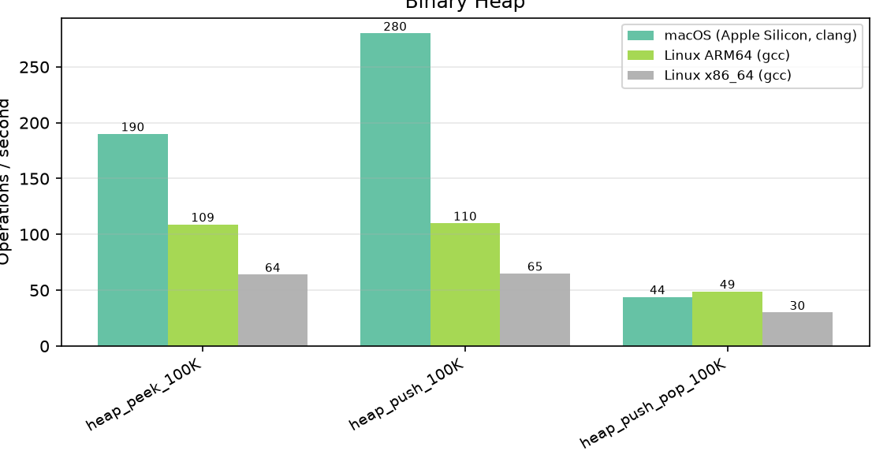
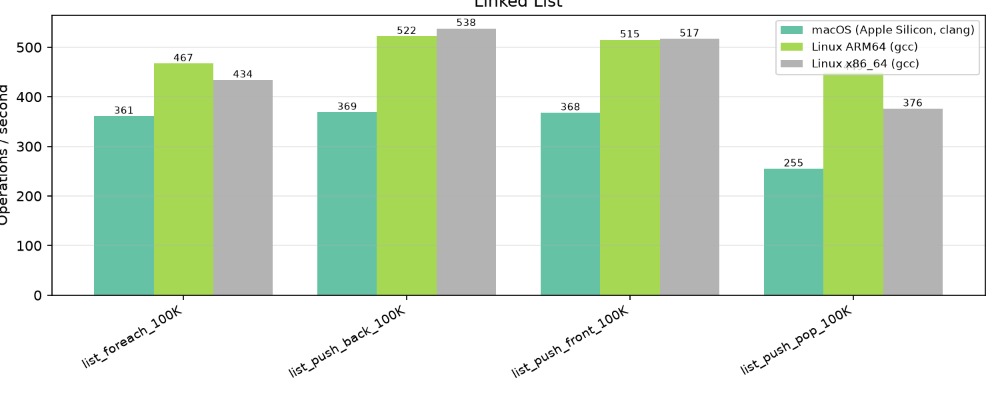

# LibZenit Benchmarks

Automated benchmark results across CI environments. Generated by `scripts/benchmark_report.py`.

## Environments

| # | Platform | Compiler |
|---|----------|----------|
| 1 | macOS (Apple Silicon, clang) | gcc / clang |
| 2 | Linux ARM64 (gcc) | gcc / clang |
| 3 | Linux x86_64 (gcc) | gcc / clang |

## Results

| Category | Benchmark | Iterations | macOS (Apple Silicon, clang) | Linux ARM64 (gcc) | Linux x86_64 (gcc) |
|---|:---|---:|:---:|:---:|:---:|
| Arena (alloc) | `arena_alloc_free_4k` | 500,000 | 116.23 Mops/s | 99.76 Mops/s | 113.71 Mops/s |
| Arena (alloc) | `arena_alloc_free_64` | 5,000,000 | 117.54 Mops/s | 103.49 Mops/s | 113.45 Mops/s |
| Arena (alloc) | `arena_alloc_free_8` | 5,000,000 | 112.21 Mops/s | 101.27 Mops/s | 113.82 Mops/s |
| Arena (overhead) | `arena_acquire_release` | 2,000,000 | 39.56 Mops/s | 55.37 Mops/s | 55.29 Mops/s |
| Arena (overhead) | `arena_create_destroy` | 500,000 | 1.49 Mops/s | 164.70 Kops/s | 67.47 Kops/s |
| Binary Heap | `heap_peek_100K` | 100 | 190 ops/s | 109 ops/s | 64 ops/s |
| Binary Heap | `heap_push_100K` | 100 | 280 ops/s | 110 ops/s | 65 ops/s |
| Binary Heap | `heap_push_pop_100K` | 20 | 44 ops/s | 49 ops/s | 30 ops/s |
| Deque | `deque_push_back_1M` | 100 | 57 ops/s | 116 ops/s | 59 ops/s |
| Deque | `deque_push_front_1M` | 100 | 61 ops/s | 116 ops/s | 76 ops/s |
| Deque | `deque_push_pop_1M` | 100 | 39 ops/s | 78 ops/s | 45 ops/s |
| Hash Map | `map_foreach_100K` | 1,000 | 2.60 Kops/s | 3.58 Kops/s | 2.45 Kops/s |
| Hash Map | `map_get_hit_100K` | 100,000 | 54.82 Mops/s | 22.70 Mops/s | 40.91 Mops/s |
| Hash Map | `map_get_miss_100K` | 100,000 | 57.50 Mops/s | 36.00 Mops/s | 37.21 Mops/s |
| Hash Map | `map_insert_100K` | 100,000 | 16.06 Mops/s | 20.36 Mops/s | 13.71 Mops/s |
| Hash Map | `map_insert_rehash_100K` | 100,000 | 14.67 Mops/s | 21.28 Mops/s | 14.32 Mops/s |
| Hash Set | `set_contains_hit_100K` | 100,000 | 69.40 Mops/s | 33.54 Mops/s | 53.19 Mops/s |
| Hash Set | `set_contains_miss_100K` | 100,000 | 64.98 Mops/s | 40.84 Mops/s | 37.78 Mops/s |
| Hash Set | `set_foreach_100K` | 1,000 | 2.53 Kops/s | 3.85 Kops/s | 2.51 Kops/s |
| Hash Set | `set_insert_100K` | 100,000 | 22.02 Mops/s | 26.13 Mops/s | 19.05 Mops/s |
| Hash Set | `set_insert_rehash_100K` | 100,000 | 23.56 Mops/s | 27.18 Mops/s | 19.83 Mops/s |
| Linked List | `list_foreach_100K` | 100 | 361 ops/s | 467 ops/s | 434 ops/s |
| Linked List | `list_push_back_100K` | 100 | 369 ops/s | 522 ops/s | 538 ops/s |
| Linked List | `list_push_front_100K` | 100 | 368 ops/s | 515 ops/s | 517 ops/s |
| Linked List | `list_push_pop_100K` | 100 | 255 ops/s | 449 ops/s | 376 ops/s |
| Ring Buffer | `ring_full_miss` | 10,000,000 | 542.62 Mops/s | 338.05 Mops/s | 202.40 Mops/s |
| Ring Buffer | `ring_seq_128` | 500,000 | 79.43 Mops/s | 92.59 Mops/s | 78.21 Mops/s |
| Ring Buffer | `ring_seq_1k` | 100,000 | 22.50 Mops/s | 20.38 Mops/s | 18.77 Mops/s |
| State Machine | `state_miss` | 10,000,000 | 379.67 Mops/s | 424.17 Mops/s | 237.27 Mops/s |
| State Machine | `state_seq_1024` | 10,000 | 3.83 Kops/s | 6.05 Kops/s | 5.08 Kops/s |
| State Machine | `state_seq_8` | 1,000,000 | 20.15 Mops/s | 41.28 Mops/s | 31.16 Mops/s |
| Vector | `vector_insert_front` | 10,000 | 3.10 Mops/s | 3.56 Mops/s | 3.86 Mops/s |
| Vector | `vector_push_pop` | 1,000,000 | 157.13 Mops/s | 241.82 Mops/s | 144.61 Mops/s |
| Vector | `vector_push_seq` | 1,000,000 | 130.34 Mops/s | 250.81 Mops/s | 126.34 Mops/s |
| Vector | `vector_reserve_push` | 1,000,000 | 122.32 Mops/s | 210.76 Mops/s | 104.07 Mops/s |
| Version | `libzenit_version` | 100,000,000 | 423.61 Mops/s | 532.28 Mops/s | 257.69 Mops/s |
| malloc (baseline) | `malloc_free_4k` | 500,000 | 986.19 Mops/s | 24.56 Mops/s | 21.06 Mops/s |
| malloc (baseline) | `malloc_free_64` | 5,000,000 | 988.14 Mops/s | 96.18 Mops/s | 86.25 Mops/s |
| malloc (baseline) | `malloc_free_8` | 5,000,000 | 985.61 Mops/s | 96.02 Mops/s | 83.52 Mops/s |

## Details by Category

### Arena (alloc)

### Arena (overhead)

### Binary Heap

### Deque

### Hash Map

### Hash Set

### Linked List

### Ring Buffer

### State Machine

### Vector

### Version

### malloc (baseline)

---

_Generated from CI benchmark job output._
