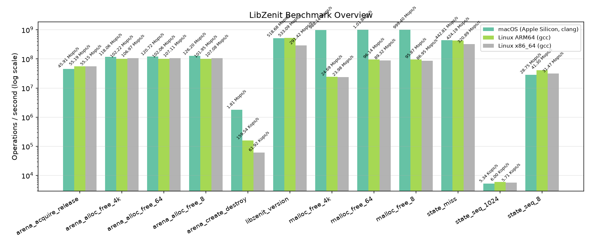
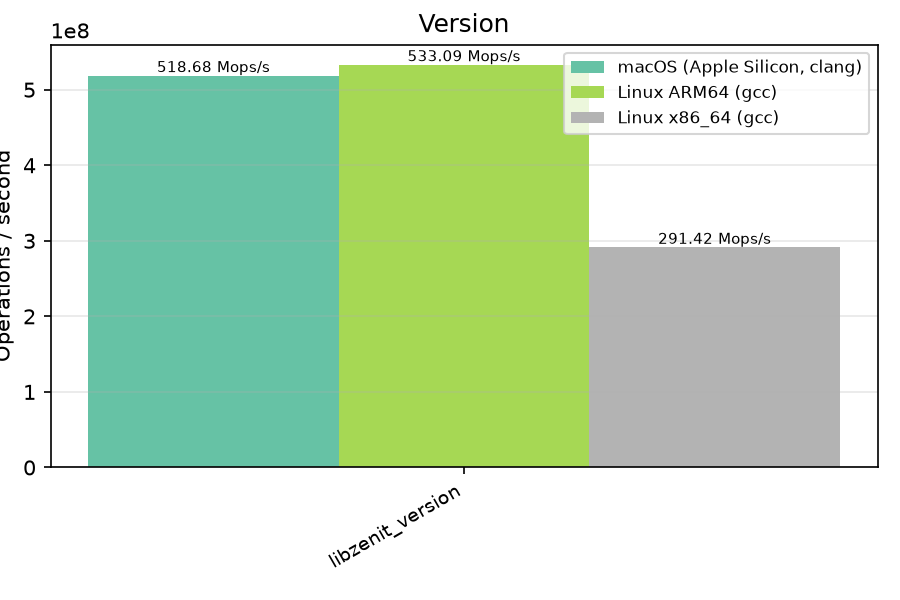
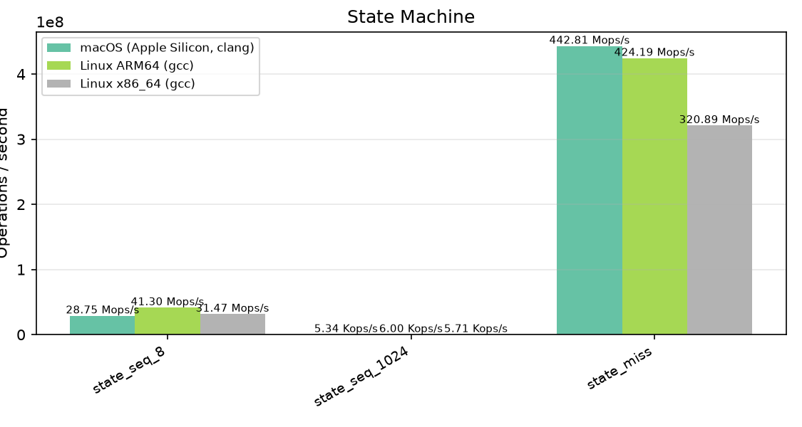
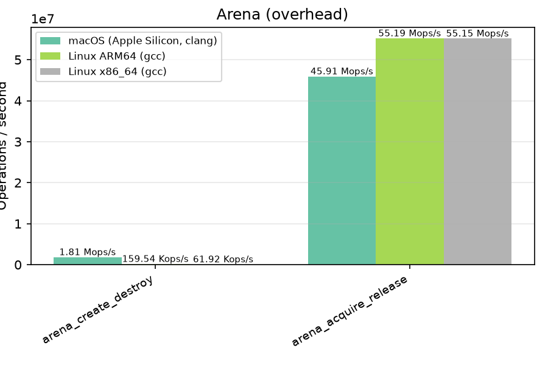
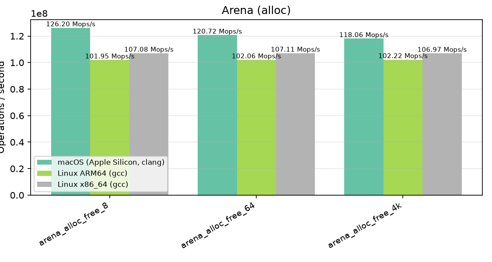
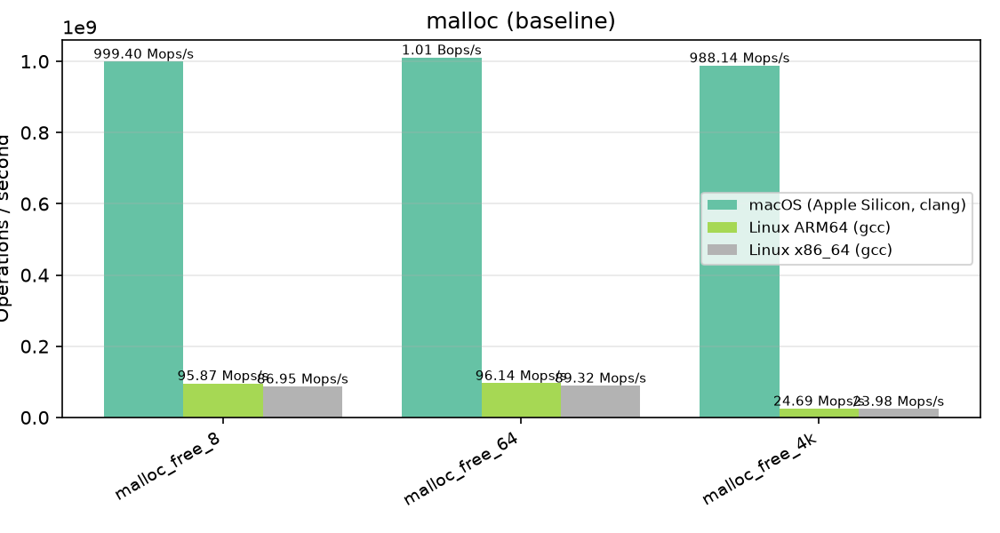

# LibZenit Benchmarks

Automated benchmark results across CI environments. Generated by `scripts/benchmark_report.py`.

## Environments

| # | Platform | Compiler |
|---|----------|----------|
| 1 | macOS (Apple Silicon, clang) | gcc / clang |
| 2 | Linux ARM64 (gcc) | gcc / clang |
| 3 | Linux x86_64 (gcc) | gcc / clang |

## Overview

All benchmarks on a logarithmic scale. Taller bars are faster.

## Results

| Benchmark | Iterations | macOS (Apple Silicon, clang) | Linux ARM64 (gcc) | Linux x86_64 (gcc) |
|---|:---:|:---:|:---:|:---:|
| `libzenit_version` | 100,000,000 | 518.68 Mops/s | 533.09 Mops/s | 291.42 Mops/s |
| `state_seq_8` | 1,000,000 | 28.75 Mops/s | 41.30 Mops/s | 31.47 Mops/s |
| `state_seq_1024` | 10,000 | 5.34 Kops/s | 6.00 Kops/s | 5.71 Kops/s |
| `state_miss` | 10,000,000 | 442.81 Mops/s | 424.19 Mops/s | 320.89 Mops/s |
| `arena_create_destroy` | 500,000 | 1.81 Mops/s | 159.54 Kops/s | 61.92 Kops/s |
| `arena_acquire_release` | 2,000,000 | 45.91 Mops/s | 55.19 Mops/s | 55.15 Mops/s |
| `arena_alloc_free_8` | 5,000,000 | 126.20 Mops/s | 101.95 Mops/s | 107.08 Mops/s |
| `arena_alloc_free_64` | 5,000,000 | 120.72 Mops/s | 102.06 Mops/s | 107.11 Mops/s |
| `arena_alloc_free_4k` | 500,000 | 118.06 Mops/s | 102.22 Mops/s | 106.97 Mops/s |
| `malloc_free_8` | 5,000,000 | 999.40 Mops/s | 95.87 Mops/s | 86.95 Mops/s |
| `malloc_free_64` | 5,000,000 | 1.01 Bops/s | 96.14 Mops/s | 89.32 Mops/s |
| `malloc_free_4k` | 500,000 | 988.14 Mops/s | 24.69 Mops/s | 23.98 Mops/s |

## Details by Category

### Version

### State Machine

### Arena (overhead)

### Arena (alloc)

### malloc (baseline)

---

_Generated from CI benchmark job output._
