# LibZenit Benchmarks

Automated benchmark results across CI environments. Generated by `scripts/benchmark_report.py`.

## Environments

| # | Platform | Compiler |
|---|----------|----------|
| 1 | macOS (Apple Silicon, clang) | gcc / clang |
| 2 | Linux ARM64 (gcc) | gcc / clang |
| 3 | Linux x86_64 (gcc) | gcc / clang |

## Results

| Category | Benchmark | Iterations | macOS (Apple Silicon, clang) | Linux ARM64 (gcc) | Linux x86_64 (gcc) |
|---|:---|---:|:---:|:---:|:---:|
| Arena | `arena_acquire_release` | 2,000,000 | 45.83 Mops/s | 53.98 Mops/s | 49.50 Mops/s |
| Arena | `arena_alloc_free_4k` | 500,000 | 116.77 Mops/s | 102.30 Mops/s | 95.59 Mops/s |
| Arena | `arena_alloc_free_64` | 5,000,000 | 120.95 Mops/s | 102.57 Mops/s | 104.98 Mops/s |
| Arena | `arena_alloc_free_8` | 5,000,000 | 126.68 Mops/s | 102.30 Mops/s | 103.46 Mops/s |
| Arena | `arena_create_destroy` | 500,000 | 89.06 Kops/s | 160.53 Kops/s | 70.98 Kops/s |
| Base64 | `base64_decode_256B` | 100,000 | 4.79 Mops/s | 4.70 Mops/s | 4.20 Mops/s |
| Base64 | `base64_encode_256B` | 100,000 | 6.69 Mops/s | 6.90 Mops/s | 4.85 Mops/s |
| Binary | `binary_search_hit` | 1,000,000 | 332.45 Mops/s | 226.29 Mops/s | 149.20 Mops/s |
| Binary | `binary_search_miss` | 1,000,000 | 24.31 Mops/s | 52.87 Mops/s | 27.11 Mops/s |
| Bitset | `bitset_count` | 100,000 | 1.22 Mops/s | 135.61 Kops/s | 32.47 Kops/s |
| Bitset | `bitset_set` | 100,000 | 192.68 Mops/s | 225.59 Mops/s | 220.58 Mops/s |
| Bitset | `bitset_test` | 100,000 | 194.93 Mops/s | 240.25 Mops/s | 197.35 Mops/s |
| Bloom | `bloom_contains_hit_100k` | 100,000 | 50.05 Mops/s | 20.68 Mops/s | 28.04 Mops/s |
| Bloom | `bloom_contains_miss_100k` | 100,000 | 27.31 Mops/s | 27.87 Mops/s | 21.08 Mops/s |
| Bloom | `bloom_insert_100k` | 100,000 | 46.43 Mops/s | 20.98 Mops/s | 15.03 Mops/s |
| Csv | `csv_parse` | 100,000 | 4.48 Mops/s | 3.15 Mops/s | 4.41 Mops/s |
| Csv | `csv_serialise` | 100,000 | 8.05 Mops/s | 5.51 Mops/s | 4.26 Mops/s |
| Deque | `deque_push_back_1M` | 100 | 76 ops/s | 116 ops/s | 60 ops/s |
| Deque | `deque_push_front_1M` | 100 | 76 ops/s | 123 ops/s | 75 ops/s |
| Deque | `deque_push_pop_1M` | 100 | 51 ops/s | 77 ops/s | 45 ops/s |
| Dir | `dir_list` | 100 | 40.05 Kops/s | 119.19 Kops/s | 46.41 Kops/s |
| Error | `error_string` | 1,000,000 | 109.22 Mops/s | 45.02 Mops/s | 29.93 Mops/s |
| Glob | `glob_class` | 10,000,000 | 67.94 Mops/s | 82.90 Mops/s | 65.53 Mops/s |
| Glob | `glob_exact` | 10,000,000 | 59.10 Mops/s | 68.91 Mops/s | 57.38 Mops/s |
| Glob | `glob_question` | 10,000,000 | 99.81 Mops/s | 125.70 Mops/s | 98.58 Mops/s |
| Glob | `glob_star` | 10,000,000 | 46.23 Mops/s | 54.05 Mops/s | 35.49 Mops/s |
| Glob | `glob_star_miss` | 10,000,000 | 49.69 Mops/s | 48.45 Mops/s | 30.06 Mops/s |
| Graph | `graph_add_edge_100K` | 100,000 | 36.38 Mops/s | 31.83 Mops/s | 25.23 Mops/s |
| Graph | `graph_add_vertex_100K` | 100,000 | 63.48 Kops/s | 67.50 Kops/s | 55.96 Kops/s |
| Graph | `graph_bfs_10K` | 10,000 | 6.25 Kops/s | 5.71 Kops/s | 10.07 Kops/s |
| Graph | `graph_get_neighbors_10K` | 100,000 | 33.21 Mops/s | 63.16 Mops/s | 53.66 Mops/s |
| Heap | `heap_peek_100K` | 100 | 314 ops/s | 108 ops/s | 64 ops/s |
| Heap | `heap_push_100K` | 100 | 309 ops/s | 108 ops/s | 65 ops/s |
| Heap | `heap_push_pop_100K` | 20 | 55 ops/s | 49 ops/s | 30 ops/s |
| Hex | `hex_decode_256B` | 100,000 | 1.77 Mops/s | 2.98 Mops/s | 2.22 Mops/s |
| Hex | `hex_encode_256B` | 100,000 | 16.01 Mops/s | 21.14 Mops/s | 23.03 Mops/s |
| Io | `io_read_1k` | 100,000 | 146.91 Kops/s | 613.10 Kops/s | 200.53 Kops/s |
| Io | `io_write_1k` | 100,000 | 10.18 Kops/s | 88.20 Kops/s | 33.94 Kops/s |
| Json | `json_build` | 50,000 | 1.85 Mops/s | 2.13 Mops/s | 2.19 Mops/s |
| Json | `json_parse` | 50,000 | 791.79 Kops/s | 654.54 Kops/s | 786.69 Kops/s |
| Json | `json_serialize` | 50,000 | 92.24 Kops/s | 107.90 Kops/s | 84.71 Kops/s |
| List | `list_foreach_100K` | 100 | 398 ops/s | 465 ops/s | 434 ops/s |
| List | `list_push_back_100K` | 100 | 415 ops/s | 514 ops/s | 518 ops/s |
| List | `list_push_front_100K` | 100 | 415 ops/s | 508 ops/s | 511 ops/s |
| List | `list_push_pop_100K` | 100 | 353 ops/s | 435 ops/s | 401 ops/s |
| Logger | `logger_filtered` | 1,000,000 | 1.83 Mops/s | 4.74 Mops/s | 4.92 Mops/s |
| Logger | `logger_filtered_fast` | 1,000,000 | 20.57 Mops/s | 23.27 Mops/s | 22.48 Mops/s |
| Logger | `logger_info` | 100,000 | 1.78 Mops/s | 4.60 Mops/s | 4.91 Mops/s |
| Lru | `lru_get_hit_100K` | 100,000 | 69.93 Mops/s | 10.12 Mops/s | 26.08 Mops/s |
| Lru | `lru_put_100K` | 100,000 | 70.22 Mops/s | 10.45 Mops/s | 27.08 Mops/s |
| Lru | `lru_put_evict_100K` | 100,000 | 2.21 Mops/s | 2.16 Mops/s | 1.72 Mops/s |
| Map | `map_foreach_100K` | 1,000 | 2.78 Kops/s | 3.59 Kops/s | 2.76 Kops/s |
| Map | `map_get_hit_100K` | 100,000 | 58.28 Mops/s | 23.00 Mops/s | 34.96 Mops/s |
| Map | `map_get_miss_100K` | 100,000 | 66.09 Mops/s | 36.50 Mops/s | 36.39 Mops/s |
| Map | `map_insert_100K` | 100,000 | 20.38 Mops/s | 20.40 Mops/s | 12.46 Mops/s |
| Map | `map_insert_rehash_100K` | 100,000 | 18.14 Mops/s | 21.41 Mops/s | 13.70 Mops/s |
| Path | `path_basename` | 100,000 | 27.42 Mops/s | 33.54 Mops/s | 29.88 Mops/s |
| Path | `path_dirname` | 100,000 | 28.99 Mops/s | 37.99 Mops/s | 32.43 Mops/s |
| Path | `path_join` | 100,000 | 31.12 Mops/s | 47.93 Mops/s | 35.88 Mops/s |
| Path | `path_normalize` | 100,000 | 11.14 Mops/s | 16.67 Mops/s | 13.46 Mops/s |
| Pool | `pool_acquire` | 1,000,000 | 489.72 Mops/s | 554.92 Mops/s | 555.52 Mops/s |
| Pool | `pool_acquire_release` | 1,000,000 | 1.47 Kops/s | 3.24 Kops/s | 2.82 Kops/s |
| Pool | `pool_small_acquire_release` | 1,000,000 | 15.36 Mops/s | 27.33 Mops/s | 19.92 Mops/s |
| Queue | `queue_enqueue` | 1,000,000 | 68.42 Mops/s | 94.68 Mops/s | 49.51 Mops/s |
| Queue | `queue_enqueue_dequeue` | 1,000,000 | 97.02 Mops/s | 127.99 Mops/s | 76.75 Mops/s |
| Queue | `queue_peek` | 1,000,000 | 616.14 Mops/s | 483.81 Mops/s | 284.22 Mops/s |
| Realloc | `realloc_fallback_64` | 100,000 | 27.47 Mops/s | 40.13 Mops/s | 33.14 Mops/s |
| Ring | `ring_full_miss` | 10,000,000 | 584.56 Mops/s | 338.56 Mops/s | 188.81 Mops/s |
| Ring | `ring_seq_128` | 500,000 | 101.03 Mops/s | 90.09 Mops/s | 75.93 Mops/s |
| Ring | `ring_seq_1k` | 100,000 | 23.03 Mops/s | 21.51 Mops/s | 20.40 Mops/s |
| Semver | `semver_compare` | 1,000,000 | 533.90 Mops/s | 423.19 Mops/s | 284.11 Mops/s |
| Semver | `semver_format` | 100,000 | 7.25 Mops/s | 6.95 Mops/s | 6.83 Mops/s |
| Semver | `semver_parse` | 1,000,000 | 8.32 Mops/s | 10.19 Mops/s | 5.74 Mops/s |
| Set | `set_contains_hit_100K` | 100,000 | 106.27 Mops/s | 35.04 Mops/s | 51.18 Mops/s |
| Set | `set_contains_miss_100K` | 100,000 | 60.98 Mops/s | 43.06 Mops/s | 36.14 Mops/s |
| Set | `set_foreach_100K` | 1,000 | 2.82 Kops/s | 3.62 Kops/s | 2.52 Kops/s |
| Set | `set_insert_100K` | 100,000 | 26.49 Mops/s | 26.13 Mops/s | 16.80 Mops/s |
| Set | `set_insert_rehash_100K` | 100,000 | 27.22 Mops/s | 27.13 Mops/s | 17.09 Mops/s |
| Sort | `sort_random_10K` | 1,000 | 763 ops/s | 1.23 Kops/s | 685 ops/s |
| Sort | `sort_sorted_10K` | 1,000 | 800 ops/s | 1.23 Kops/s | 686 ops/s |
| Spsc | `spsc_pop_push` | 1,000,000 | 97.64 Mops/s | 65.70 Mops/s | 78.49 Mops/s |
| Spsc | `spsc_push_pop` | 1,000,000 | 98.72 Mops/s | 52.83 Mops/s | 85.14 Mops/s |
| Stable | `stable_sort_random_10K` | 1,000 | 818 ops/s | 1.35 Kops/s | 706 ops/s |
| Stable | `stable_sort_sorted_10K` | 1,000 | 1.50 Kops/s | 2.96 Kops/s | 1.36 Kops/s |
| Stack | `stack_peek` | 1,000,000 | 457.25 Mops/s | 424.19 Mops/s | 218.89 Mops/s |
| Stack | `stack_push` | 1,000,000 | 163.91 Mops/s | 222.91 Mops/s | 107.92 Mops/s |
| Stack | `stack_push_pop` | 1,000,000 | 99.21 Mops/s | 145.98 Mops/s | 80.82 Mops/s |
| State | `state_miss` | 10,000,000 | 456.52 Mops/s | 424.19 Mops/s | 237.06 Mops/s |
| State | `state_seq_1024` | 10,000 | 5.48 Kops/s | 6.07 Kops/s | 2.63 Kops/s |
| State | `state_seq_8` | 1,000,000 | 34.81 Mops/s | 43.51 Mops/s | 22.51 Mops/s |
| Str | `str_join_16` | 100,000 | 7.66 Mops/s | 7.99 Mops/s | 4.25 Mops/s |
| Str | `str_split_16` | 100,000 | 1.98 Mops/s | 1.75 Mops/s | 1.55 Mops/s |
| Str | `str_trim` | 100,000 | 30.96 Mops/s | 41.62 Mops/s | 37.43 Mops/s |
| String | `string_append_64B` | 100,000 | 4.31 Mops/s | 4.09 Mops/s | 2.21 Mops/s |
| String | `string_append_cstr_8B` | 100,000 | 20.03 Mops/s | 21.45 Mops/s | 13.36 Mops/s |
| Thread | `thread_pool_enqueue` | 10,000 | 6.74 Mops/s | 187.39 Kops/s | 867.91 Kops/s |
| Timer | `timer_elapsed_ns` | 10,000,000 | 799.04 Mops/s | 565.54 Mops/s | 284.68 Mops/s |
| Timer | `timer_now` | 10,000,000 | 36.10 Mops/s | 32.32 Mops/s | 33.82 Mops/s |
| Trie | `trie_insert` | 100,000 | 32.44 Mops/s | 11.76 Mops/s | 6.07 Mops/s |
| Trie | `trie_search_hit` | 100,000 | 35.82 Mops/s | 72.21 Mops/s | 44.62 Mops/s |
| Trie | `trie_search_miss` | 100,000 | 86.88 Mops/s | 64.87 Mops/s | 45.40 Mops/s |
| Trie | `trie_starts_with` | 100,000 | 159.74 Mops/s | 141.47 Mops/s | 110.18 Mops/s |
| Uri | `uri_decode` | 100,000 | 11.35 Mops/s | 13.86 Mops/s | 10.08 Mops/s |
| Uri | `uri_encode` | 100,000 | 11.77 Mops/s | 9.24 Mops/s | 9.72 Mops/s |
| Uuid | `uuid_format` | 1,000,000 | 101.82 Mops/s | 69.80 Mops/s | 74.80 Mops/s |
| Uuid | `uuid_generate` | 100,000 | 4.58 Mops/s | 2.98 Mops/s | 1.38 Mops/s |
| Uuid | `uuid_parse` | 1,000,000 | 23.99 Mops/s | 36.78 Mops/s | 22.40 Mops/s |
| Vector | `vector_insert_front` | 10,000 | 3.30 Mops/s | 3.57 Mops/s | 4.19 Mops/s |
| Vector | `vector_push_pop` | 1,000,000 | 169.49 Mops/s | 235.02 Mops/s | 145.83 Mops/s |
| Vector | `vector_push_seq` | 1,000,000 | 164.74 Mops/s | 250.17 Mops/s | 125.60 Mops/s |
| Vector | `vector_reserve_push` | 1,000,000 | 171.47 Mops/s | 207.66 Mops/s | 111.45 Mops/s |
| Version | `libzenit_version` | 100,000,000 | 581.11 Mops/s | 534.79 Mops/s | 256.97 Mops/s |
| Zenit | `zenit_alloc_free_64` | 1,000,000 | 63.88 Mops/s | 91.25 Mops/s | 78.46 Mops/s |
| malloc (baseline) | `malloc_free_4k` | 500,000 | 954.20 Mops/s | 24.87 Mops/s | 23.32 Mops/s |
| malloc (baseline) | `malloc_free_64` | 1,000,000 | 1.07 Bops/s | 95.76 Mops/s | 93.70 Mops/s |
| malloc (baseline) | `malloc_free_8` | 5,000,000 | 880.75 Mops/s | 95.16 Mops/s | 83.72 Mops/s |

## Details by Category

### Arena

### Base64

### Binary

### Bitset

### Bloom

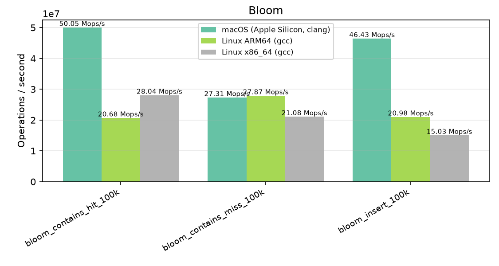

### Csv

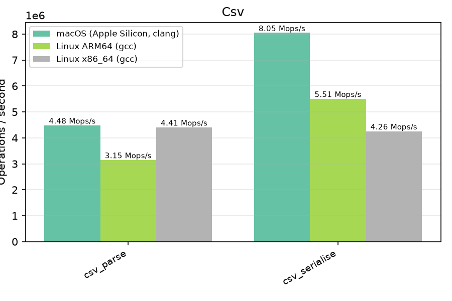

### Deque

### Dir

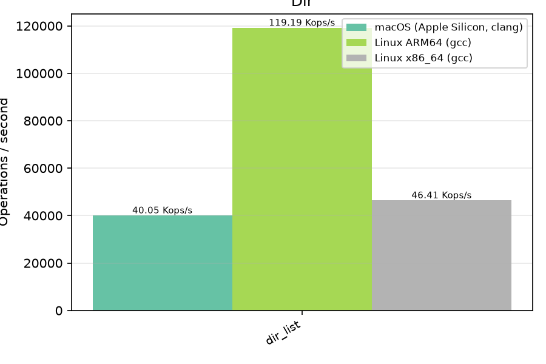

### Error

### Glob

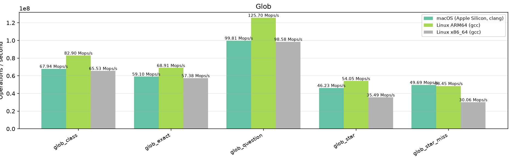

### Graph

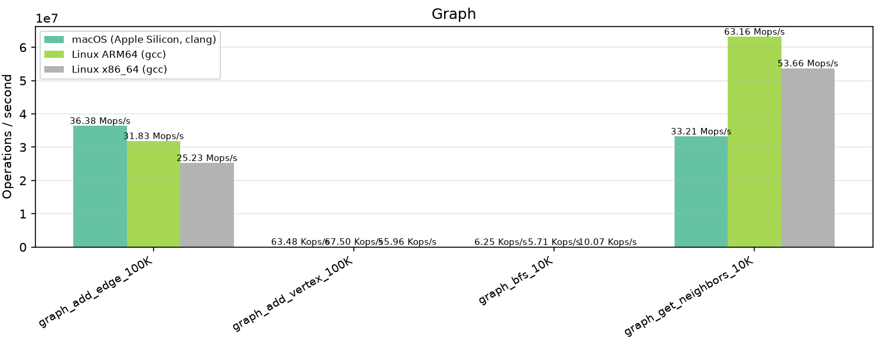

### Heap

### Hex

### Io

### Json

### List

### Logger

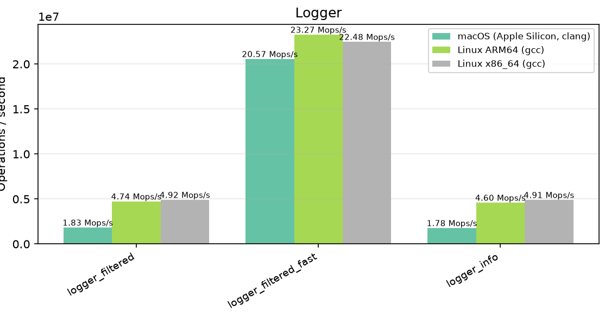

### Lru

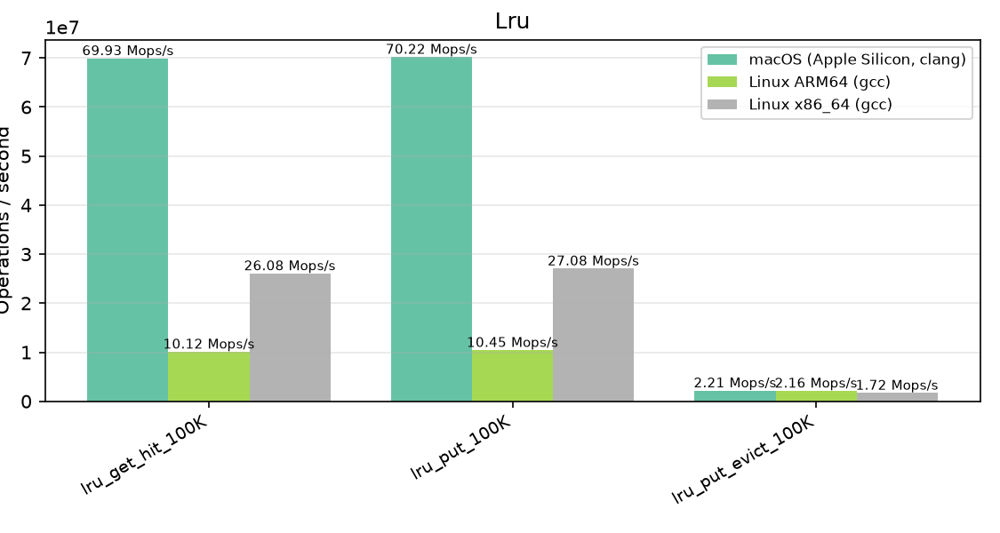

### Map

### Path

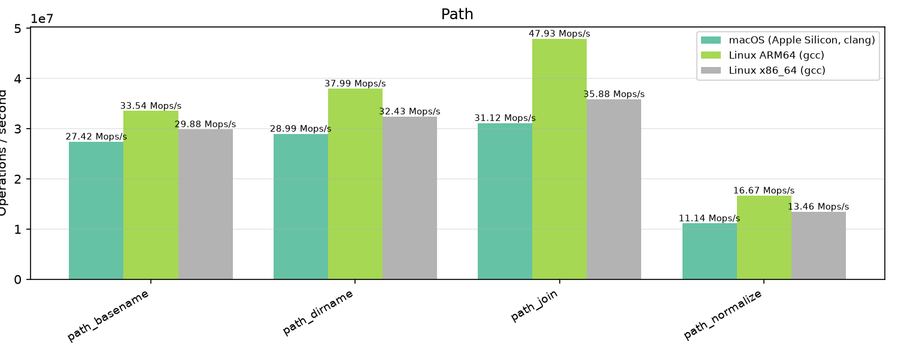

### Pool

### Queue

### Realloc

### Ring

### Semver

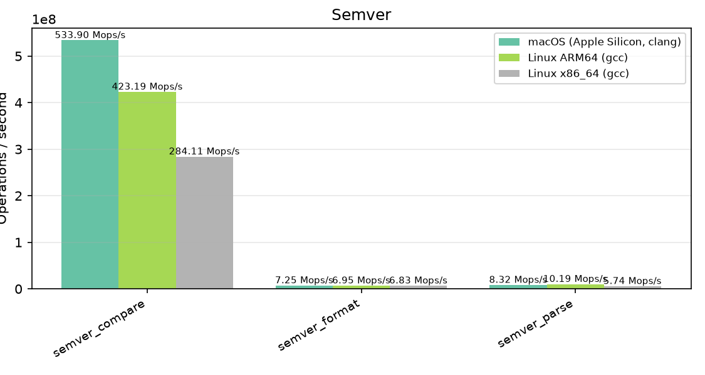

### Set

### Sort

### Spsc

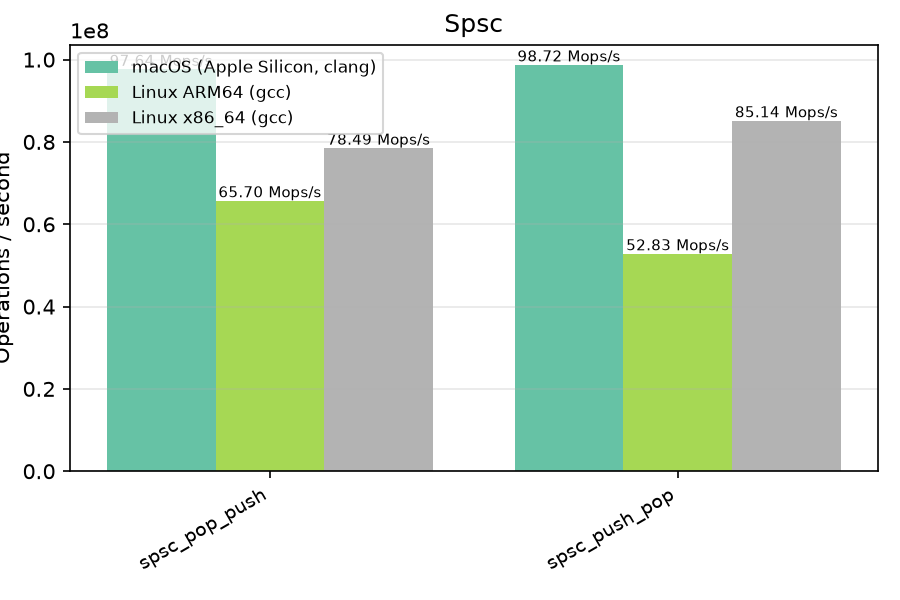

### Stable

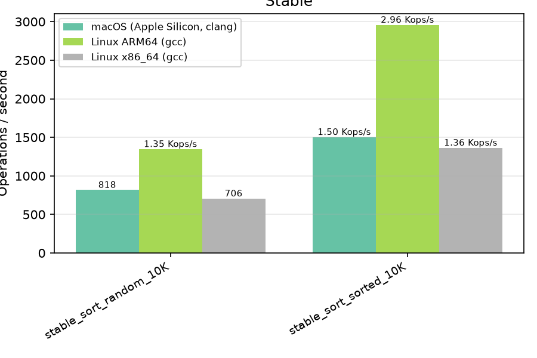

### Stack

### State

### Str

### String

### Thread

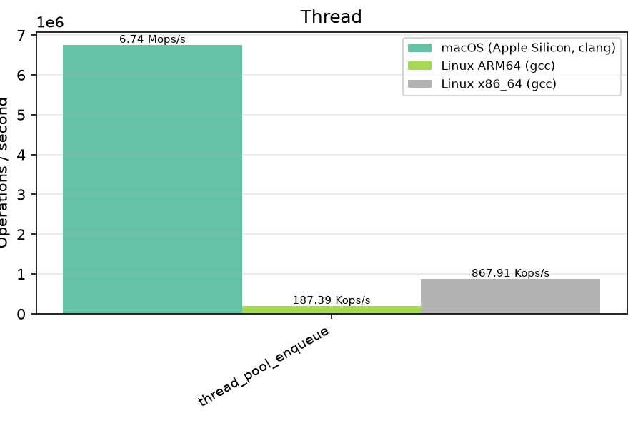

### Timer

### Trie

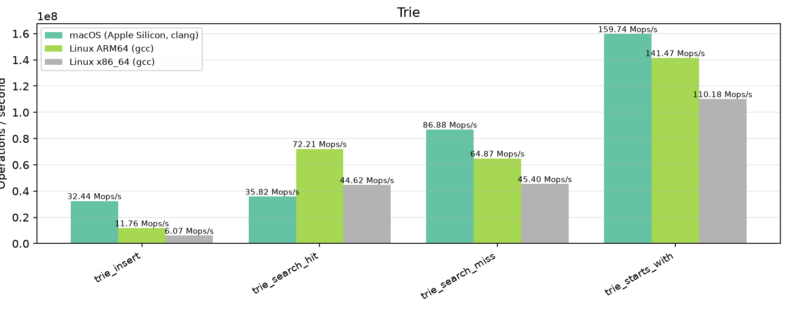

### Uri

### Uuid

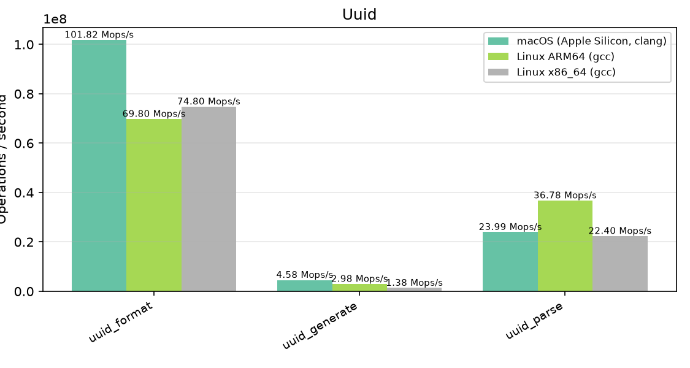

### Vector

### Version

### Zenit

### malloc (baseline)

---

_Generated from CI benchmark job output._
