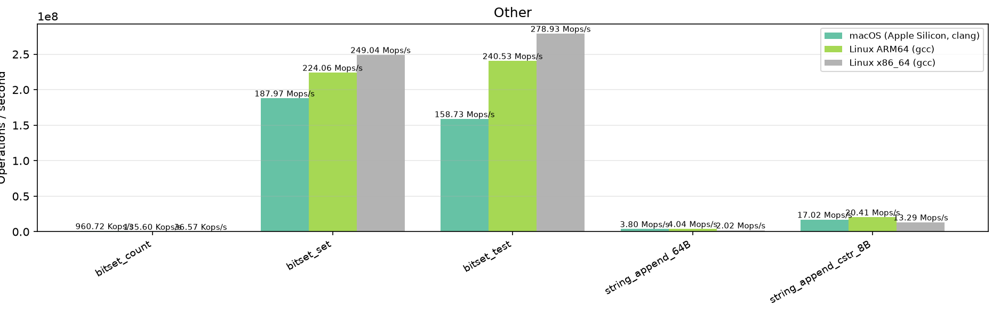

# LibZenit Benchmarks

Automated benchmark results across CI environments. Generated by `scripts/benchmark_report.py`.

## Environments

| # | Platform | Compiler |
|---|----------|----------|
| 1 | macOS (Apple Silicon, clang) | gcc / clang |
| 2 | Linux ARM64 (gcc) | gcc / clang |
| 3 | Linux x86_64 (gcc) | gcc / clang |

## Results

| Category | Benchmark | Iterations | macOS (Apple Silicon, clang) | Linux ARM64 (gcc) | Linux x86_64 (gcc) |
|---|:---|---:|:---:|:---:|:---:|
| Arena (alloc) | `arena_alloc_free_4k` | 500,000 | 107.07 Mops/s | 100.01 Mops/s | 100.36 Mops/s |
| Arena (alloc) | `arena_alloc_free_64` | 5,000,000 | 109.24 Mops/s | 99.75 Mops/s | 100.26 Mops/s |
| Arena (alloc) | `arena_alloc_free_8` | 5,000,000 | 107.55 Mops/s | 98.62 Mops/s | 100.17 Mops/s |
| Arena (overhead) | `arena_acquire_release` | 2,000,000 | 36.78 Mops/s | 54.59 Mops/s | 50.93 Mops/s |
| Arena (overhead) | `arena_create_destroy` | 500,000 | 91.35 Kops/s | 167.23 Kops/s | 52.20 Kops/s |
| Binary Heap | `heap_peek_100K` | 100 | 234 ops/s | 108 ops/s | 60 ops/s |
| Binary Heap | `heap_push_100K` | 100 | 259 ops/s | 108 ops/s | 61 ops/s |
| Binary Heap | `heap_push_pop_100K` | 20 | 45 ops/s | 49 ops/s | 28 ops/s |
| Deque | `deque_push_back_1M` | 100 | 54 ops/s | 116 ops/s | 65 ops/s |
| Deque | `deque_push_front_1M` | 100 | 60 ops/s | 123 ops/s | 72 ops/s |
| Deque | `deque_push_pop_1M` | 100 | 38 ops/s | 77 ops/s | 47 ops/s |
| Hash Map | `map_foreach_100K` | 1,000 | 2.59 Kops/s | 3.59 Kops/s | 2.33 Kops/s |
| Hash Map | `map_get_hit_100K` | 100,000 | 51.26 Mops/s | 23.08 Mops/s | 43.74 Mops/s |
| Hash Map | `map_get_miss_100K` | 100,000 | 59.21 Mops/s | 37.83 Mops/s | 41.81 Mops/s |
| Hash Map | `map_insert_100K` | 100,000 | 15.82 Mops/s | 20.36 Mops/s | 14.71 Mops/s |
| Hash Map | `map_insert_rehash_100K` | 100,000 | 16.26 Mops/s | 21.72 Mops/s | 15.58 Mops/s |
| Hash Set | `set_contains_hit_100K` | 100,000 | 85.11 Mops/s | 32.15 Mops/s | 51.14 Mops/s |
| Hash Set | `set_contains_miss_100K` | 100,000 | 55.96 Mops/s | 42.75 Mops/s | 40.18 Mops/s |
| Hash Set | `set_foreach_100K` | 1,000 | 2.55 Kops/s | 3.62 Kops/s | 2.36 Kops/s |
| Hash Set | `set_insert_100K` | 100,000 | 21.20 Mops/s | 26.27 Mops/s | 19.02 Mops/s |
| Hash Set | `set_insert_rehash_100K` | 100,000 | 22.53 Mops/s | 27.05 Mops/s | 19.23 Mops/s |
| Linked List | `list_foreach_100K` | 100 | 333 ops/s | 463 ops/s | 458 ops/s |
| Linked List | `list_push_back_100K` | 100 | 359 ops/s | 515 ops/s | 473 ops/s |
| Linked List | `list_push_front_100K` | 100 | 361 ops/s | 506 ops/s | 534 ops/s |
| Linked List | `list_push_pop_100K` | 100 | 300 ops/s | 433 ops/s | 419 ops/s |
| Other | `bitset_count` | 100,000 | 960.72 Kops/s | 135.60 Kops/s | 36.57 Kops/s |
| Other | `bitset_set` | 100,000 | 187.97 Mops/s | 224.06 Mops/s | 249.04 Mops/s |
| Other | `bitset_test` | 100,000 | 158.73 Mops/s | 240.53 Mops/s | 278.93 Mops/s |
| Other | `string_append_64B` | 100,000 | 3.80 Mops/s | 4.04 Mops/s | 2.02 Mops/s |
| Other | `string_append_cstr_8B` | 100,000 | 17.02 Mops/s | 20.41 Mops/s | 13.29 Mops/s |
| Ring Buffer | `ring_full_miss` | 10,000,000 | 490.46 Mops/s | 338.73 Mops/s | 263.15 Mops/s |
| Ring Buffer | `ring_seq_128` | 500,000 | 91.47 Mops/s | 90.92 Mops/s | 78.66 Mops/s |
| Ring Buffer | `ring_seq_1k` | 100,000 | 19.46 Mops/s | 21.62 Mops/s | 22.84 Mops/s |
| State Machine | `state_miss` | 10,000,000 | 408.68 Mops/s | 424.15 Mops/s | 291.13 Mops/s |
| State Machine | `state_seq_1024` | 10,000 | 5.04 Kops/s | 6.08 Kops/s | 2.97 Kops/s |
| State Machine | `state_seq_8` | 1,000,000 | 32.69 Mops/s | 42.40 Mops/s | 22.95 Mops/s |
| Vector | `vector_insert_front` | 10,000 | 3.10 Mops/s | 3.56 Mops/s | 4.43 Mops/s |
| Vector | `vector_push_pop` | 1,000,000 | 153.44 Mops/s | 233.40 Mops/s | 163.85 Mops/s |
| Vector | `vector_push_seq` | 1,000,000 | 135.52 Mops/s | 247.20 Mops/s | 135.04 Mops/s |
| Vector | `vector_reserve_push` | 1,000,000 | 152.86 Mops/s | 203.87 Mops/s | 124.14 Mops/s |
| Version | `libzenit_version` | 100,000,000 | 577.11 Mops/s | 533.57 Mops/s | 291.92 Mops/s |
| malloc (baseline) | `malloc_free_4k` | 500,000 | 994.04 Mops/s | 24.75 Mops/s | 23.98 Mops/s |
| malloc (baseline) | `malloc_free_64` | 5,000,000 | 865.35 Mops/s | 96.21 Mops/s | 89.31 Mops/s |
| malloc (baseline) | `malloc_free_8` | 5,000,000 | 913.24 Mops/s | 95.66 Mops/s | 86.88 Mops/s |

## Details by Category

### Arena (alloc)

### Arena (overhead)

### Binary Heap

### Deque

### Hash Map

### Hash Set

### Linked List

### Other

### Ring Buffer

### State Machine

### Vector

### Version

### malloc (baseline)

---

_Generated from CI benchmark job output._
