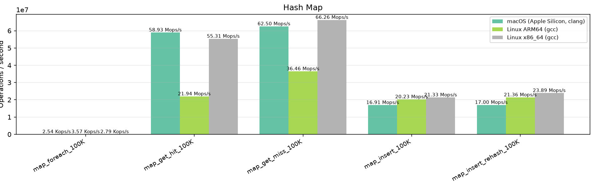
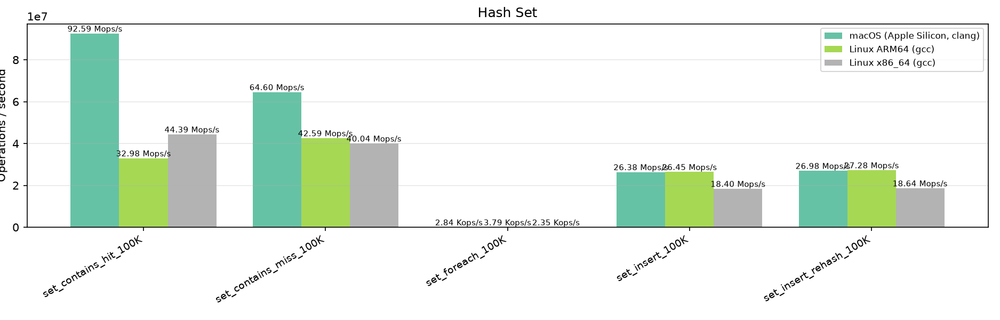
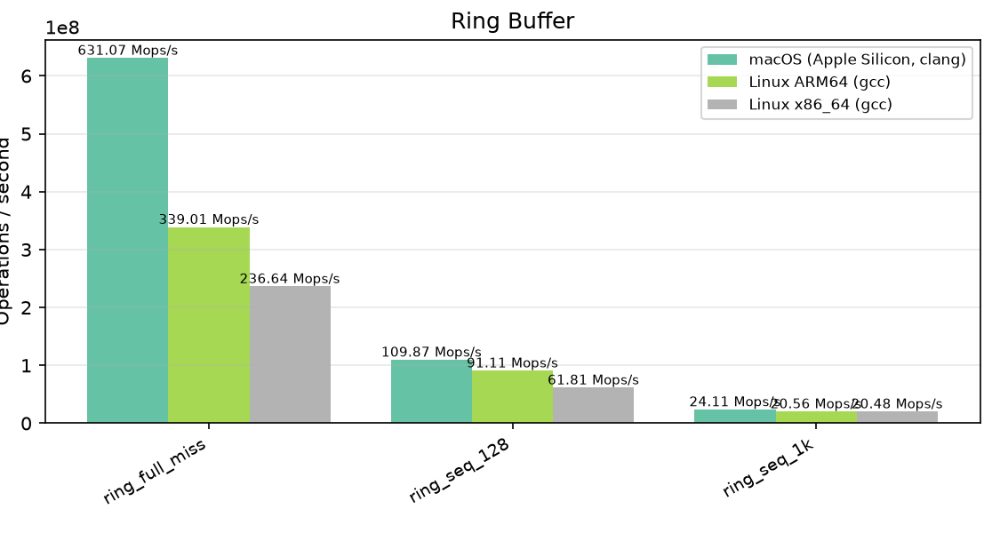

# LibZenit Benchmarks

Automated benchmark results across CI environments. Generated by `scripts/benchmark_report.py`.

## Environments

| # | Platform | Compiler |
|---|----------|----------|
| 1 | macOS (Apple Silicon, clang) | gcc / clang |
| 2 | Linux ARM64 (gcc) | gcc / clang |
| 3 | Linux x86_64 (gcc) | gcc / clang |

## Results

| Category | Benchmark | Iterations | macOS (Apple Silicon, clang) | Linux ARM64 (gcc) | Linux x86_64 (gcc) |
|---|:---|---:|:---:|:---:|:---:|
| Arena (alloc) | `arena_alloc_free_4k` | 500,000 | 125.63 Mops/s | 103.98 Mops/s | 103.53 Mops/s |
| Arena (alloc) | `arena_alloc_free_64` | 5,000,000 | 126.44 Mops/s | 103.84 Mops/s | 103.46 Mops/s |
| Arena (alloc) | `arena_alloc_free_8` | 5,000,000 | 126.63 Mops/s | 100.89 Mops/s | 103.60 Mops/s |
| Arena (overhead) | `arena_acquire_release` | 2,000,000 | 45.90 Mops/s | 55.33 Mops/s | 54.32 Mops/s |
| Arena (overhead) | `arena_create_destroy` | 500,000 | 1.83 Mops/s | 149.42 Kops/s | 51.69 Kops/s |
| Hash Map | `map_foreach_100K` | 1,000 | 2.99 Kops/s | 3.57 Kops/s | 2.31 Kops/s |
| Hash Map | `map_get_hit_100K` | 100,000 | 76.57 Mops/s | 18.46 Mops/s | 27.03 Mops/s |
| Hash Map | `map_get_miss_100K` | 100,000 | 69.83 Mops/s | 36.26 Mops/s | 39.93 Mops/s |
| Hash Map | `map_insert_100K` | 100,000 | 20.41 Mops/s | 19.98 Mops/s | 13.43 Mops/s |
| Hash Map | `map_insert_rehash_100K` | 100,000 | 21.05 Mops/s | 20.54 Mops/s | 14.55 Mops/s |
| Hash Set | `set_contains_hit_100K` | 100,000 | 144.51 Mops/s | 29.77 Mops/s | 42.70 Mops/s |
| Hash Set | `set_contains_miss_100K` | 100,000 | 69.35 Mops/s | 43.18 Mops/s | 40.26 Mops/s |
| Hash Set | `set_foreach_100K` | 1,000 | 3.02 Kops/s | 3.84 Kops/s | 2.35 Kops/s |
| Hash Set | `set_insert_100K` | 100,000 | 29.01 Mops/s | 26.18 Mops/s | 19.34 Mops/s |
| Hash Set | `set_insert_rehash_100K` | 100,000 | 28.11 Mops/s | 27.05 Mops/s | 19.37 Mops/s |
| Other | `deque_push_back_1M` | 100 | 66 ops/s | 114 ops/s | 65 ops/s |
| Other | `deque_push_front_1M` | 100 | 63 ops/s | 115 ops/s | 74 ops/s |
| Other | `deque_push_pop_1M` | 100 | 51 ops/s | 77 ops/s | 45 ops/s |
| Other | `heap_peek_100K` | 100 | 309 ops/s | 109 ops/s | 61 ops/s |
| Other | `heap_push_100K` | 100 | 321 ops/s | 110 ops/s | 60 ops/s |
| Other | `heap_push_pop_100K` | 20 | 56 ops/s | 49 ops/s | 28 ops/s |
| Other | `list_foreach_100K` | 100 | 424 ops/s | 465 ops/s | 473 ops/s |
| Other | `list_push_back_100K` | 100 | 440 ops/s | 521 ops/s | 546 ops/s |
| Other | `list_push_front_100K` | 100 | 441 ops/s | 513 ops/s | 545 ops/s |
| Other | `list_push_pop_100K` | 100 | 375 ops/s | 448 ops/s | 416 ops/s |
| Ring Buffer | `ring_full_miss` | 10,000,000 | 635.20 Mops/s | 338.56 Mops/s | 244.77 Mops/s |
| Ring Buffer | `ring_seq_128` | 500,000 | 109.63 Mops/s | 90.45 Mops/s | 80.92 Mops/s |
| Ring Buffer | `ring_seq_1k` | 100,000 | 24.44 Mops/s | 20.37 Mops/s | 20.63 Mops/s |
| State Machine | `state_miss` | 10,000,000 | 449.18 Mops/s | 424.13 Mops/s | 321.50 Mops/s |
| State Machine | `state_seq_1024` | 10,000 | 5.50 Kops/s | 6.05 Kops/s | 5.66 Kops/s |
| State Machine | `state_seq_8` | 1,000,000 | 35.03 Mops/s | 41.27 Mops/s | 30.22 Mops/s |
| Vector | `vector_insert_front` | 10,000 | 3.48 Mops/s | 3.56 Mops/s | 4.44 Mops/s |
| Vector | `vector_push_pop` | 1,000,000 | 178.51 Mops/s | 237.41 Mops/s | 161.98 Mops/s |
| Vector | `vector_push_seq` | 1,000,000 | 149.61 Mops/s | 246.38 Mops/s | 136.42 Mops/s |
| Vector | `vector_reserve_push` | 1,000,000 | 183.02 Mops/s | 198.74 Mops/s | 111.29 Mops/s |
| Version | `libzenit_version` | 100,000,000 | 624.51 Mops/s | 533.55 Mops/s | 290.01 Mops/s |
| malloc (baseline) | `malloc_free_4k` | 500,000 | 1.07 Bops/s | 24.85 Mops/s | 23.83 Mops/s |
| malloc (baseline) | `malloc_free_64` | 5,000,000 | 1.06 Bops/s | 96.07 Mops/s | 89.15 Mops/s |
| malloc (baseline) | `malloc_free_8` | 5,000,000 | 1.07 Bops/s | 95.76 Mops/s | 86.73 Mops/s |

## Details by Category

### Arena (alloc)

### Arena (overhead)

### Hash Map

### Hash Set

### Ring Buffer

### State Machine

### Vector

### Version

### malloc (baseline)

---

_Generated from CI benchmark job output._
